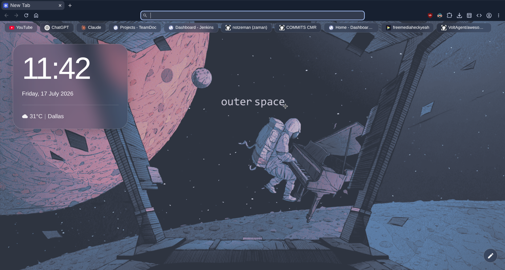

# Helium Clock



A minimal New Tab page for Chromium browsers with a live clock, weather, bookmarks bar, and custom wallpaper support.

## Features

- Live clock with date
- Dynamic weather via wttr.in (auto-detects your location)
- Bookmarks bar pulled from your Chrome bookmarks (with folder dropdowns)
- Custom wallpaper picker (persisted in localStorage)

## Installation

1. Clone the repo:
   ```
   git clone https://github.com/notzeman/custom-chromiuim.git
   ```

2. Open Chrome/Chromium and navigate to `chrome://extensions/`

3. Enable **Developer mode** (toggle in top-right corner)

4. Click **Load unpacked** and select the cloned `helium-clock` folder

The new tab page will now show Helium Clock.

## Usage

- **Wallpaper**: Click the pen icon (bottom-right) and choose your favorite wallpaper! 
- **Weather**: Auto-detected, refreshes every 10 minutes
- **Bookmarks**: Your Chrome bookmark bar items appear as pills at the top; click a folder pill to expand, click the cross icon on any bookmark to delete it
